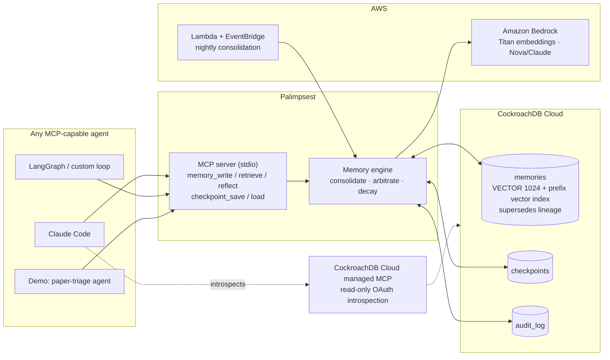

# Palimpsest — agent memory that survives, on CockroachDB

> A palimpsest is a manuscript page scraped clean and written over — with the earlier writing still faintly visible beneath.
> That is how agent memory should work: **new knowledge layers over old, and history is never destroyed.**

Palimpsest is a **production-grade memory layer for AI agents**, backed by CockroachDB.
Any agent — Claude Code, LangGraph, a custom loop — plugs in through **MCP** and gets:

- **Episodic → semantic lifecycle** — every task execution writes episodic memory; a nightly consolidation job (AWS Lambda + Bedrock) distills recurring facts into long-term semantic memory.
- **Temporal conflict arbitration** — when new facts contradict old ones, Palimpsest writes a reconciliation with explicit time sense ("X held before May, updated to Y since") instead of a blind overwrite. Old layers remain queryable — hence the name.
- **Forgetting curve** — memory heat = access frequency × recency decay; cold memories are demoted out of the retrieval index (archived, never destroyed).
- **Two-stage retrieval** — SQL prefix filtering (owner/tags) then ANN search on CockroachDB's distributed vector index.
- **Crash-safe by construction** — memories, checkpoints, and audit log live in a distributed SQL database that survives node and region failure. Kill the agent; its memory is intact. Paid tokens are never spent twice.

Built for the [CockroachDB × AWS Hackathon](https://cockroachdb-ai.devpost.com/) — *Agents that think. Agents that act. Agents that remember.*

## Architecture



## Quickstart

```bash
pip install -e .
# put your CockroachDB URI in a .crdb-connection file (or set PALIMPSEST_DB_URL)
python tests/smoke_e2e.py          # live end-to-end check
python demo/triage_agent.py --help # the demo agent
```

Plug any MCP-capable agent in:

```json
{ "mcpServers": { "palimpsest": {
    "command": "palimpsest-mcp",
    "env": { "PALIMPSEST_OWNER": "my-agent" } } } }
```

## CockroachDB & AWS tooling used

| Tool | How Palimpsest uses it |
|---|---|
| **Distributed vector index** | `CREATE VECTOR INDEX (owner_id, embedding vector_cosine_ops)` — prefix-filtered cosine ANN powers all semantic retrieval ([schema](db/schema.sql)) |
| **CockroachDB Cloud managed MCP** | The developing agent introspects the memory store (schemas, indexes, analytics) through Cockroach Labs' hosted MCP endpoint, read-only OAuth |
| **Agent Skills** | Patterns from this project contributed upstream: [cockroachlabs/cockroachdb-skills#17](https://github.com/cockroachlabs/cockroachdb-skills/pull/17) (`designing-agent-memory-schemas`) |
| **Amazon Bedrock** | Titan Text Embeddings V2 (1024-dim) for all embeddings; Nova/Claude for consolidation & arbitration (provider-switchable via `PALIMPSEST_LLM_MODEL`) |
| **AWS Lambda + EventBridge** | Nightly consolidation job ([handler](src/palimpsest/adapters/lambda_consolidate.py)) — the demo's `night` command runs the identical code path |

## Status

Work in progress — hackathon submission period (June 30 – Aug 18, 2026).
Core engine, MCP server, demo agent, and live end-to-end tests are complete;
Lambda deployment and the hosted demo are in progress.

## Provenance disclosure

The memory-lifecycle *concepts* (episodic→semantic consolidation, temporal arbitration,
heat decay, two-stage retrieval) were first prototyped by the author in
[JarvisQwen](https://github.com/Vector897/JarvisQwen) as a ~150-line SQLite +
keyword-matching module. Palimpsest is a ground-up rewrite created during the
submission period: new codebase, CockroachDB distributed storage, real vector
retrieval, MCP interface, and AWS-native consolidation. No code is shared.

## License

[Apache-2.0](LICENSE)
